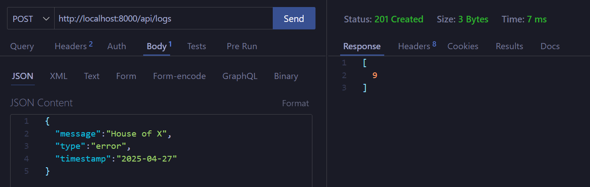
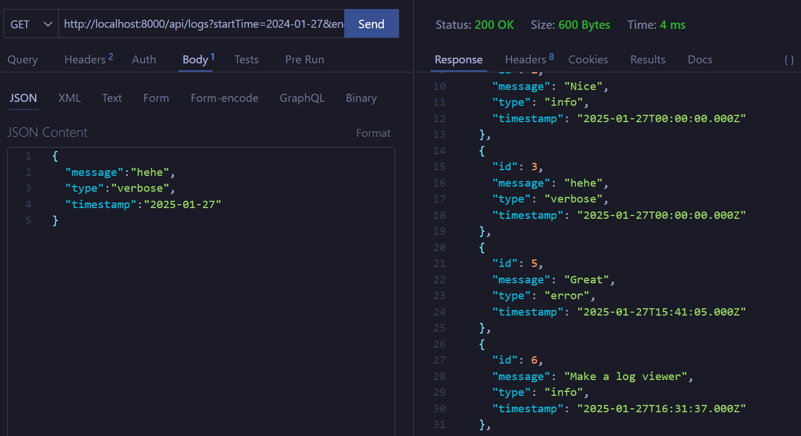
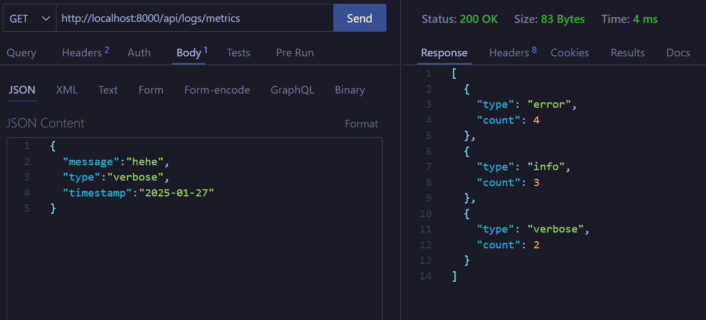
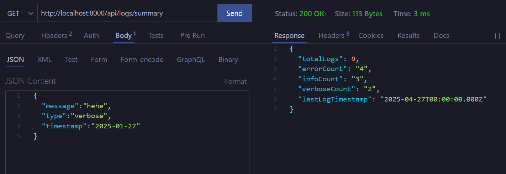
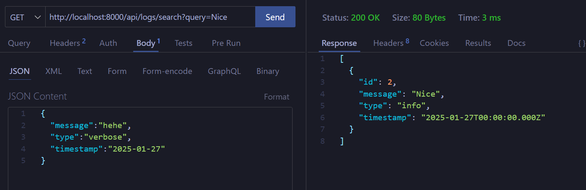
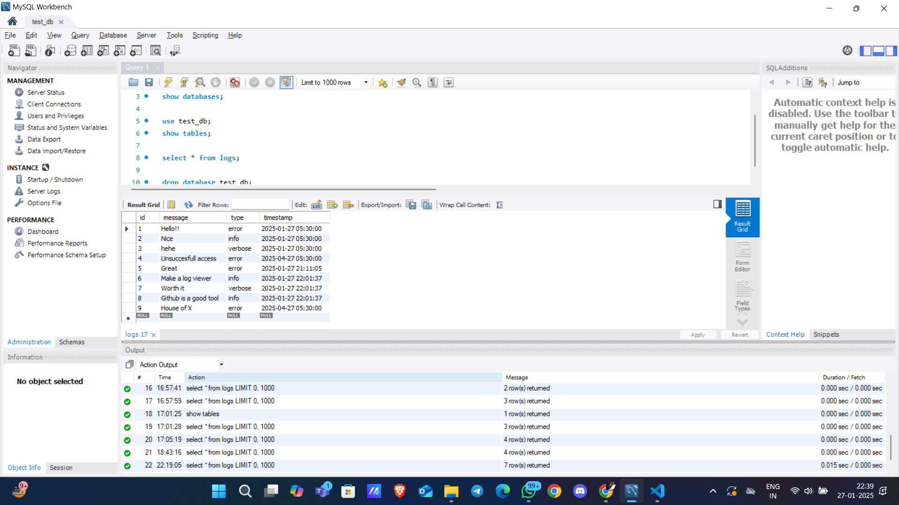

## 📽 Video Demonstration

[**Click here to view the video**](https://drive.google.com/file/d/1CbOZ06dXBZSO_ZcmhEi9Z072_iI4FWMH/view?usp=sharing)

---

### 📊 API Results Snapshots

Below are snapshots showcasing the API endpoints' responses for various operations:

1. **API Result 1**  
   
2. **API Result 2**  
   
3. **API Result 3**  
   
4. **API Result 4**  
   
5. **API Result 5**  
   

---

### 💻 Tech Stack Overview - Typescript

#### **Frontend**:

- **React**
- **Tailwind CSS**
- **React Query**
- **Charts**
- **TypeScript**

#### **Backend**:

- **Node**
- **Express**
- **WebSockets**
- **Axios**

#### **Database**:

- **MySQL + Knex**
- **React Query**

---

### 📂 Database Schema

#### **Database Initialization**

```sql
USE test_db;

CREATE TABLE logs (
    id SERIAL PRIMARY KEY,
    message VARCHAR NOT NULL,
    type VARCHAR CHECK (type IN ('error', 'info', 'verbose')) NOT NULL,
    timestamp TIMESTAMP DEFAULT CURRENT_TIMESTAMP
);

CREATE INDEX idx_logs_timestamp ON logs(timestamp);
CREATE INDEX idx_logs_type ON logs(type);
```

#### **Table Details**:

- **`logs` Table**:
  - **Columns**:
    - `id`: Unique identifier for each log entry.
    - `message`: Log message description.
    - `type`: Specifies log type (`error`, `info`, or `verbose`).
    - `timestamp`: Auto-generated log entry timestamp.
  - **Indexes**:
    - **`idx_logs_timestamp`**: Optimizes queries based on log timestamps.
    - **`idx_logs_type`**: Speeds up queries filtered by log type.

#### **SQL Workbench Snapshot**:


